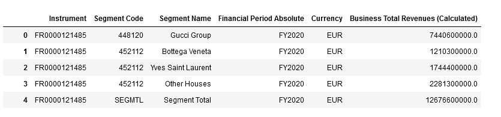
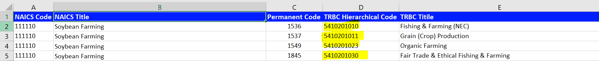
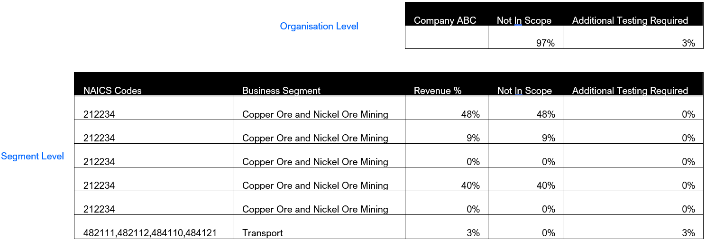
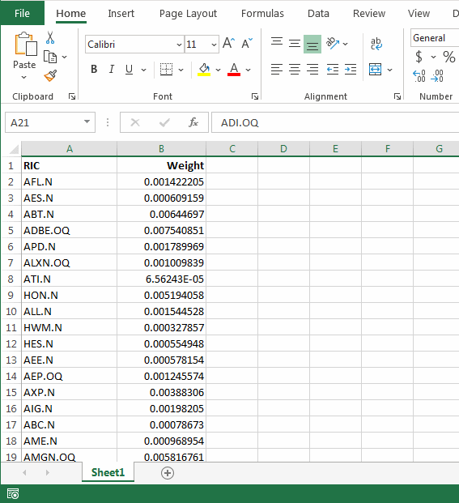
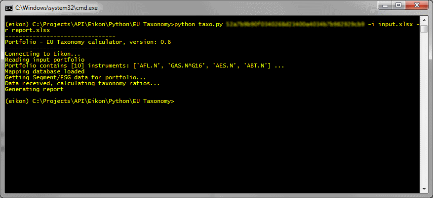
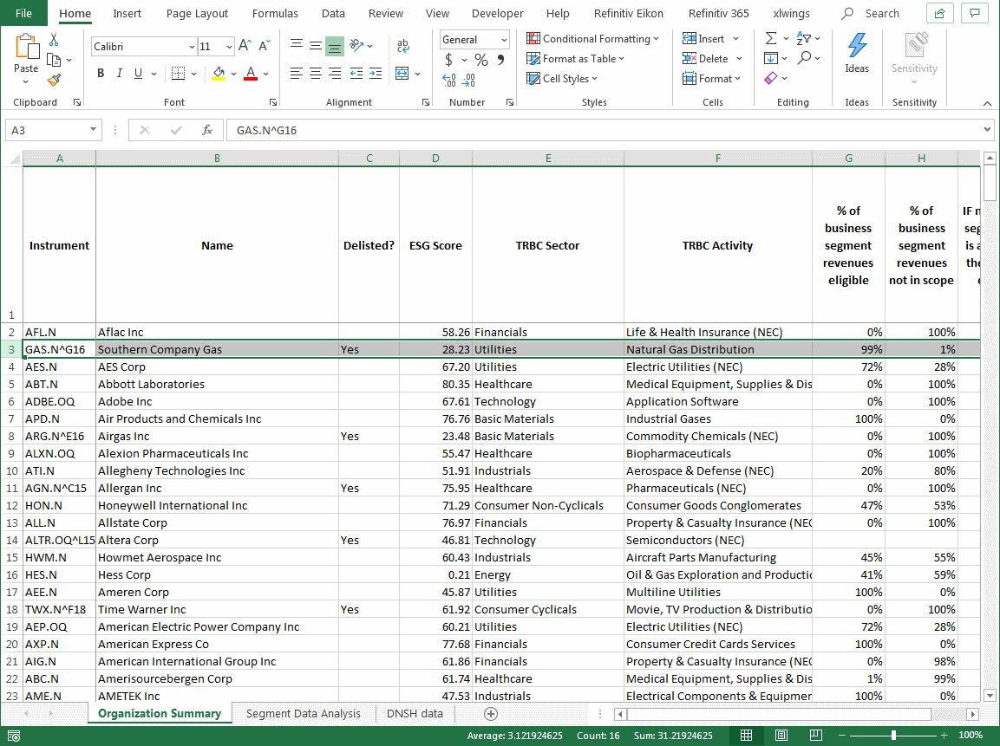

# How to calculate the "EU taxonomy of sustainable activities regulation" for a portfolio
*Andre - suggest a better heading*

## Overview
*Andre - What is EU taxo and why this is needed*

The EU taxonomy introduces six objectives to measure the portfolio exposute. These objectives are:
1.	**Climate change mitigation**
2.	**Climate change adaptation**
3.	The sustainable use and protection of water and marine resources
4.	The transition to a circular economy
5.	Pollution prevention and control
6.	The protection and restoration of biodiversity and ecosystems

In this article we will model and employ a *Python* script, which will use *Eikon Data API* to help investors measure the objective #**1** & #**2** of the EU taxonomy. The Python application will calculate the percentage of revenues for a portfolio, at both a portfolio level and at constituent level which are eligible or aligned with the objectives.

Underpinning the model is the [Excel tool](https://ec.europa.eu/info/files/sustainable-finance-teg-taxonomy-tools_en) provided by TEG on the 13th March 2020. A common classification of economic activities that substantially contribute to climate change mitigation and adaptation are made available. There will be changes to this model as data providers such as ourselves, evolve our business classifications to capture new and emerging economic activities. So further alignment with other classifications and change is to be expected, but this is a useful first step. The same tool also provides details about the technical screening criteria for both activities that can make a substantial contribution to climate change mitigation and climate change adaptation. In this article and the Python sample, we are only using climate mitigation technical screening criteria.

## Methodology and Implementation
At a broad level the sample application performs following activities:

1. Load the input portfolio to be analyzed
2. Load the database which contain the mapping between the NAICS and TRBC and the various testing metrics
3. Retrieve the segment and ESG data for the portfolio constituents from Eikon
4. Massage and transpose the data to find out the exposure to climate change objective
5. Generate a report

These steps are explained below:

### 1. Load the input portfolio
The input portfolio for which the *climate change taxonomy* objective is to be measured is read from an excel spreadsheet. Pertinent information needed in the input spreadsheet, is the *unique identifiers* and the corresponding *weights*. In the sample it is assumed that spreadsheet column *A2* contains all of the unique identifiers and from *B2* contains the weights for each constituent.

The function ```loadInputPortfolio(pFilename)``` reads the spreadsheet into a Pandas dataframe and moves on to download the business segment revenue data.

### 2. Retrieve company segment revenues 
With the full list identifier codes available via the input file, we need to download the *business total revenue* at a segment level for the latest fiscal year. The business total revenues field is derived from company disclosed sources, and Eikon field *TR.BGS.BusTotalRevenue* provides this information. Following sub-fields are use to capture the actual revenue, fiscal year and NAICS codes for the segment:  
*	value
*	segmentCode
*	segmentName
*	fperiod
*	currency

The business total revenue field has some additional output options and by default the output is set to *Value* which provides the revenue figures only. For the EU Taxonomy script to work it is critical we have the *segmentCode* output option. The *segmentCode* output provides details about the *North American Industry Classification System* or *NAICS* for short of each business segment. It is these codes which will later be used to verify, if a segment is a part of the EU taxonomy. There can be up to four NAICS codes assigned to each business segment as reported by the company. There’s no limit to how many business segments per company. The same field also provides codes to help understand if revenue data relates to *Segment total*, *Eliminations*, *Other operations* or *Consolidated Total* etc.
The output options like *segmentName* whilst not essential are very useful, such as knowing the segment names and the related fiscal year period and the reporting currency.

In the python application the function ```getData(inputlist)``` is responsible to retrieving this data from Eikon, using the *Eikon Data API*.

```
# get sector revenue data
txk, err = ek.get_data(inputlist, ['TR.BGS.BusTotalRevenue.segmentCode', 
	'TR.BGS.BusTotalRevenue.segmentName', 
	'TR.BGS.BusTotalRevenue.fperiod', 
	'TR.BGS.BusTotalRevenue.currency', 
	'TR.BGS.BusTotalRevenue.value'])
```

The result is a Pandas dataframe. Here is an example of revenue data for *Kering group*: 




### 3. Calculate the segment revenue as a percentage
The model is designed to seggregate business segment revenues which are stemming from the classification of economic activities, that substantially contribute to the climate change mitigation and adaptation. In order to do that we need to combine two outputs and:

1. Calculate segment revenues as a percentage
2. Find out how many NAICS codes per segment match with the EU classification and substantially contribute to the climate change initiative

The first output is a simple calculation, where if there is a NAICs code available for the segment, then divide this figure with the segment total for the company. The code *SEGMTL* is the total revenue figure for the segment.

Using this information, the model is then able to calculate the segment revenue percentage of the segmental total. In the implementation, we decided to use *segment total* versus the *consolidated total* because the later would include other revenues at a company level, which cannot be identified from a classification point of view. These revenues can be *Realized investment gains (losses)*, *Intersegment Eliminations* or *Corporate Expense/Other* etc, which are not part of segment revenue.

The code snippet which performs this calculation is contained in the function ```getTaxoForRic()```:

```
# Step 3: Calculate the segment revenue share
txkSeg = pd.DataFrame(buisData[~buisData['Segment Code'].str.match('SEGMTL|ICELIM|EXPOTH|CONSTL')])
revList = txkSeg['Business Total Revenues (Calculated)'].to_list()
if sum(revList) < 10:
	return processEmpty(ric, buisData, esgData)
	
segRevenueRatio = [x/sum(revList) for x in revList]
```

### 4. Convert NAICS code to Refinitiv business classification equivalent
In order to identify which business segment NAICS codes match with the EU Taxonomy, we must convert the raw NAICS 2007 codes into either NACE or TRBC codes.
* NACE is Nomenclature Statistique des Activités économiques dans la Communauté Européenne. Or translated into English *The Statistical classification of economic activities in the European Community*.
* TRBC stands for Refinitiv Business Classification (formerly Thomson Reuters Business Classification).

The script reads and loads the Excel file called *database.xlsx* as a pandas dataframe. This database contains multiple sheets and the one titled *NAICS>TRBC* contains the conversion mapping table. The NAICS codes are based on the NAICS 2007 version and TRBC is using the latest 2020 updates which include new economic activities such as Solar Electric Utilities. 

|As of 3rd Feb 2021 – NAICS codes downloaded from Eikon are currently based on the NAICS 2007 version. Refinitiv is planning on updating these to the NAICS 2017 standard in 2021.|
|---|

One limitation of this model is that since the *NAICS>TRBC* mapping table has a one to many relationships e.g. for one NAICS code you can have multiple equivalent TRBC codes. The model will only return the first TRBC code it finds. This means in the example below concerning Soybean Farming, the first TRBC code for Fishing & Farming is used. Fishing and Farming is included in the draft list of eligible economic activities as of April 2021. However it requires further testing whereas Organic farming does not. Users may want to configure the order or TRBC codes relative to NAICS.



The code snippet which standardizes and performs this conversion is:

```
# Step 5: Convert NAICS code to TRBC codes for every segment
#-----------------------------------
segCodeList = txkSeg.iloc[idx]['Segment Code'].split(',')
trbcCodeList = []
for naicCode in segCodeList:
  if(naicCode.isnumeric()):
    # append 0 if the code is < 6 chars
    if len(naicCode) < 6:
      naicCode = naicCode + '0'
    # lookup the NIACS -> TRBC code
    trbMatch = TRBC_db[TRBC_db['NAICS Code'] == int(naicCode)]
    if trbMatch.empty:
      trbcCodeList.append(0)
    else:
      trbcCodeList.append(trbMatch.iloc[0]['TRBC Hierarchical Code'])

txkSeg.at[idx, 'TRBC Codes'] = ', '.join(str(e) for e in trbcCodeList)
```


### 5. Matching TRBC codes to the EU climate change taxonomy 
Now that the model has found an equivalent TRBC code, the next step is to see if any of these match against the list of climate change economic activities. The worksheet titled *EU Taxonomy* in the database spreadsheet contains the TRBC code groups. Any TRBC code not found in the EU Taxonomy table is *not in scope*. These will show up as *na* or not available. This doesn’t mean that future EU taxonomy objectives won’t include these at a future stage. If the model does find a match, then a value of *Yes* or *No* will be returned in the generated report. So, what do these mean? 

|It’s important to mention, that if either *yes* or *no* value is returned, then the activity is *eligible* from an EU taxonomy sustainable activity point of view.|
|:---|

* Yes = *Additional testing needed* – for many industries this means a series of screening criteria tests need to be performed in order to determine if the activity is *aligned*. The targets and thresholds for these industry activities were made publicly available in the [Excel tool](https://ec.europa.eu/info/files/sustainable-finance-teg-taxonomy-tools_en) provided by TEG. We will provide further details about this in the next couple of steps.
* No = *No further testing needed* – revenue stemming from these activities are considered not to require further testing, and therefore are *aligned*. 

```
# Step 6: match against EU taxonomy
matchAgainstTaxo = []
for tCode in trbcCodeList:
  txnMatch = TAXON_db[TAXON_db['TRBC code'] == tCode]
  if txnMatch.empty:
    matchAgainstTaxo.append('na')
  else:
    matchAgainstTaxo.append(txnMatch.iloc[0]['Additional testing needed?'])

txkSeg.at[idx, 'Match with EU Taxo'] = ', '.join(str(e) for e in matchAgainstTaxo)
```


### 6. Technical screening criteria 
The next step of the model is to check if any of the industry codes mapped to each business segment are part of the technical screening criteria. The worksheet *Testing Metrics* in the database contains the Refinitiv ESG measure and the thresholds for each TRBC activity. For the testing metrics the model only includes 9 NACE activities out of the 72 in total outlined in Mitigation Full Data worksheet of the [Excel tool](https://ec.europa.eu/info/files/sustainable-finance-teg-taxonomy-tools_en). The model does not incorporate screening criteria tests for Adaptation.

#### Why only 9 NACE activities? 
As of the fourth quarter of 2020, content research teams within Refinitiv performed a data coverage check against the **Mitigation Full Data** screening criteria. Many of the technical criteria and thresholds did not exist within either fundamental operating metrics database or the ESG database. Several results meant only partial matches, and these were excluded from the model. Only direct matches were included, and these pertained to two ESG datapoints. Cement CO2 Emissions Equivalents and Fleet CO2 Emissions.
 
|Refinitiv will be expanding coverage of the mitigation full data technical screening criteria throughout 2021 and assessing as and when details become available for the other objectives criteria. We also expect the model and the driving database to be updated to accommodate for these when they become available.|
|:---|

Once a positive match has been found with an industry activity the first step is to identify what the technical screening is. For the script this is one of two options – Fleet CO2 emissions or Cement CO2 emissions equivalents and is read from database.

```
# Step 7: Is TRBC Code aligned to assesement metric
alignedMetricName = []
alignedMetricField = []
for tCode in trbcCodeList:
  metMatch = TESTING_MET_db[TESTING_MET_db['TRBC Activity'] == tCode]
  if not metMatch.empty:
    alignedMetricName.append(metMatch.iloc[0]['Refinitiv ESG Data Measures'])
    alignedMetricField.append(metMatch.iloc[0]['Refinitiv ESG Field'])
  else:
    alignedMetricName.append('')

if not all('' == s for s in alignedMetricName):
  txkSeg.at[idx, 'Linked Assesment Metric'] = ', '.join(str(e) for e in alignedMetricName)

alignedMetricField = list(set(alignedMetricField))
```

### 7. Retrieving company reported performance metrics
If a successful, the script will have identified which Refinitiv data measure to use to perform the screening criteria test.
The script will show the standardized company reported value into the same units of measure as required by the technical screening criteria. For example, the CO2 equivalent emissions in g/km. Currently the ESG data is predominantly reported at an organizational level only. Even though the ESG values are reported at an organizational level, the testing is being performed at business segment level based on business classification codes available. 

```
# Step 8: What is company reported value for aligned metric
if len(alignedMetricField) > 0:
  repValues = []
  for almn in alignedMetricName:
    if almn in esgData.columns:
      repValues.append(esgData[almn][0])
    else:
      repValues.append('')

  #if not all(pd.isna(s) or '' == s for s in repValues):
  txkSeg.at[idx, 'Metric Reported Value'] = ', '.join(str(e) for e in repValues)
```

### 8. Passing the technical screening criteria tests
We simplify the stated testing metrics and thresholds from database spreadsheet *Testing Metrics* into single ESG data point for the purposes of this model.
For example:
```
NACE Industry Activity Code: 23.51
NACE Activity Name: Manufacture of cement
TRBC Activity Code: 5120201012
TRBC Activity Name: Cement & Concrete Manufacturing
Metric: Specific emissions associated to the clinker and cement production processes
Threshold: 0.498 tCO2e/t
```
Original full description:
```
Thresholds for cement Clinker (A) are applicable to plants that produce clinker only, and do not produce finished cement. All other plants need to meet the thresholds for cement or alternative binder 
(A) Cement clinker: 
    Specific emissions (calculated according to the methodology used for EU-ETS benchmarks) associated to the clinker production processes are lower than the value of the related EU-ETS benchmark.
    As of February 2020, the EU-ETS benchmark value for cement clinker manufacturing is: 0.766 tCO2e/t of clinker  
(B) Cement: 
    Specific emissions associated to the clinker and cement production processes are lower than: 0.498 tCO2e/t of cement or alternative binder 
```

In the case of the cement industry activity, Refinitiv has data pertaining to total CO2 and CO2 equivalents emission in tonnes per tonne of cement produced. So, section A of the technical screening criteria relating to cement clinker production can’t be calculated as of April 2021. However technical screening can be performed against section B and the target of **0.498 tCO2e/t** is used to benchmark against company reported data.
To pass the threshold test, the emissions stated by a company need to be lower than **0.498 tCO2e/t**.
The model compares the company reported figure against the threshold and will return one of three outcomes within the Excel generated report:

| Result | Meaning |
|---|---|
|  Value is lower than threshold  |  Aligned - Passed Screening Criteria Threshold Test |
|  Value is higher than threshold |  Eligible but not aligned (Did not pass threshold test) |
|  Null no data available  |  Additional Testing Required |

```
# Step 9: Does it pass threshold test
threasoldValues = []
for tCode in trbcCodeList:
  metMatch = TESTING_MET_db[TESTING_MET_db['TRBC Activity'] == tCode]
  if metMatch.empty:
    threasoldValues.append('')
  else:
    threasoldValues.append(metMatch.iloc[0]['Used for testing'])
```


### 9. Calculating segment level taxonomy results
To calculate the result for the whole business, the model first counts how many TRBC/NAICS codes there are per business segment (there can be a max of 4) and then equally weights each of these. Refinitiv does have details about which of the NAICS codes are primary – i.e. the industry activity that best describes the primary products or services the segment is providing. However as of the time of writing this article, there are no methods to expose this level of detail and therefore all NAICS codes are treated with equal importance.

The next step is to then calculate what percentage of segment revenues fall into each of the following segment taxonomy categories: 
* *Business Segment Level - Eligible %*
* *Business Segment Level - Eligible - but not aligned %*
* *Business Segment Level - Not in scope %*
* *Business Segment Level - Aligned by industry activity %*
* *Business Segment Level - Aligned passed technical screening criteria %*
* *Business Segment Level - Aligned total %*
* *Business Segment Level - Additional testing needed %*

To calculate the following formula is used: ```Segment Revenue % * (Count of EU taxonomy results * Weight of segment code)```

```
# Step 10: What is the weight of each code per segment
weightOfEachCode = 1/len(segCodeList)
txkSeg.at[idx, 'Segment Weight'] = weightOfEachCode

# Step 13: Convert taxo result into %
segRev = segRevenueRatio[idx] * weightOfEachCode
txkSeg.at[idx, 'Aligned'] = segRev * matchAgainstTaxo.count('No')
txkSeg.at[idx, 'Additional Testing Required'] = segRev * matchAgainstTaxo.count('Yes')
txkSeg.at[idx, 'Not in Scope'] = segRev * matchAgainstTaxo.count('na')
```

### 10. Calculating organization level taxonomy results
To calculate the organization level results, the model sums up the segment level data.
For example, to calculate the percentage of revenues that are *not in scope* with the EU Taxonomy at an organization level, we simply sum all the percentages *not in scope* for each business segment. Below is an example illustrating *Not in Scope* and *Additional Testing Required*.




### 11. Using organization TRBC activity code when no business segment revenue available
Since many companies don’t report revenues at a segment level, that can often leave gaps in the reporting of the overall portfolio. To overcome this limitation, the model uses the organization level TRBC activity code if no business segment revenue data is available. It checks to see if the code is available in the EU taxonomy. Since there’s no distinction from a segment revenue perspective, the script takes a binary approach and assigns 100% of revenues to either eligible or not in scope. There’s no further breakdown e.g. *additional testing needed* or *% revenues aligned* etc.

#### Do No Significant Harm & Minimum Social Safeguards
Understanding the percentage of a company’s revenues are eligible or align with the EU taxonomy is one part. In addition to this an assessment of *Do no significant harm* and *Minimum social safeguard* also need to be factored in. The model does this by downloading for all the constituents in the portfolio (and where ESG data exists) environmental and social controversies covering the latest fiscal year period. Recent controversies are updated weekly. Below is a list of all the controversies being captured, the first two focus on environmental controversies whereas all the remaining controversies are grouped under the Social umbrella.

| Code | Title |
|:---|:---|
| TR.ControvEnv | Environmental Controversies Count 
| TR.RecentControvEnv				 | Recent Environmental Controversies			 |
| TR.ControvCopyrights               | Intellectual Property Controversies           |
| TR.ControvPublicHealth             | Public Health Controversies                   |
| TR.ControvBusinessEthics           | Business Ethics Controversies                 |
| TR.ControvTaxFraud                 | Tax Fraud Controversies                       |
| TR.ControvAntiCompetition          | Anti-Competition Controversies Count          |
| TR.ControvCriticalCountries        | Critical Countries Controversies              |
| TR.RecentControvPublicHealth       | Recent Public Health Controversies            |
| TR.RecentControvBusinessEthics     | Recent Business Ethics Controversies          |
| TR.RecentControvTaxFraud           | Recent Tax Fraud Controversies                |
| TR.RecentControvAntiCompetition    | Recent Anti-Competition Controversy           |
| TR.RecentControvCriticalCountries  | Recent Critical Countries Controversies       |
| TR.RecentControvCopyrights         | Recent Intellectual Property Controversies    |
| TR.ControvHumanRights              | Human Rights Controversies                    |
| TR.ControvChildLabor               | Child Labor Controversies                     |
| TR.RecentControvHumanRights        | Recent Human Rights Controversies             |
| TR.RecentControvChildLabor         | Recent Child Labor Controversies              |
| TR.ControvConsumer                 | Consumer Complaints Controversies Count       |
| TR.RecentControvConsumer           | Recent Consumer Controversies                 |
| TR.ControvCustomerHS               | Controversies Customer Health & Safety        |
| TR.ControvResponsibleRD            | Controversies Responsible R&D                 |
| TR.ControvPrivacy                  | Controversies Privacy                         |
| TR.ControvRespMarketing            | Controversies Responsible Marketing           |
| TR.ControvProductAccess            | Controversies Product Access                  |
| TR.RecentControvCustomerHS         | Recent Customer Health & Safety Controversies |
| TR.RecentControvPrivacy            | Recent Privacy Controversies                  |
| TR.RecentControvRespMarketing      | Recent Responsible Marketing Controversies    |
| TR.RecentControvProductAccess      | Recent Product Access Controversies           |
| TR.RecentControvResponsibleRD      | Recent Responsible R&D Controversies          |
| TR.Strikes                         | Strikes                                       |
| TR.ControvEmployeesHS              | Employees Health & Safety Controversies       |
| TR.RecentControvEmployeesHS        | Recent Employee Health & Safety Controversies |

Please refer to [ESG Scores]() for description and additional details about these metrics.

#### DNSH (Do No Significant Harm)
To determine DNSH, the model looks at whether the company has made a public statement around the following criteria:

| Code | Title | Description |
|:---|:---|:---|
| TR.EnvProducts  |  Environmental Products | Does the company report on at least one product line or service that is designed to have positive effects on the environment or which is environmentally labeled and marketed? - in focus are the products and services that have positive environmental effects, or marketed as which solve environment problems.  |
| TR.LandEnvImpactReduction  |  Land Environmental Impact Reduction | Does the company report on initiatives to reduce the environmental impact on land owned, leased or managed for production activities or extractive use? - relevant to companies involved in agriculture, mining & oil and gas - in scope are the information on remediation, reclamation or remediation of disturbed land by operations.  |
| TR.EcoDesignProducts  |  Eco-Design Products | Does the company report on specific products which are designed for reuse, recycling or the reduction of environmental impacts? - products that have been specifically designed with the goal of being recycled, reused or which are disposed of without negatively impacting the environment - there must be some discussion of environmental concerns during the product design.  |

If a company has both a *TRUE* value next to any of the above metrics, and has an environmental controversy, then the model classes this as a **red** flag, which is shown in the generated excel report in the *Organization Summary* worksheet.

```
# Merge DNSH data
contvSum = dnshTemp['Environmental Controversies Count'] + dnshTemp['Recent Environmental Controversies']
contvSum[contvSum == 0] = pd.NA
summDF['DNSH Principle - Environment Controversies Count'] = contvSum
promoteSum = (dnshTemp['Environmental Products'] == 'True') | (dnshTemp['Land Environmental Impact Reduction'] == 'True') | (dnshTemp['Eco-Design Products'] == 'True')
summDF['Does the company promote environmentally friendly or eco-design products or land impact reduction?'] = promoteSum
summDF['DNSH - Environment Red Flag (Count > 0 and promotes environmentally products)'] = promoteSum & (contvSum > 0)
summDF['Minimum Social Safeguards - Social Controversies Count'] = dnshTemp.sum(axis=1)
```

#### Minimum Social Safeguards
To capture minimum social safeguards, the model shows the sum of all social themed controversies per company in the *Organization Summary* worksheet report. Values for each controversy data point can be found in the worksheet titled *DNSH data* within the auto-generated report. The output for each data point is a count of how many controversies there were for a given topic, these are manually processed by a team of trained ESG controversy analysts.


## Trying it out

The python application source code and the accompnying database of mapping is provided in the references below. To run the sample a user will need:

* A working Refinitiv Eikon installation
* Python 3.6 or higher
* Supporting Python modules like Refinitiv Eikon and OpenPyXL read/write Excel files

To run the sample open a python prompt and use following command line:
```
python taxo.py EIKON_KEY <-i input portfolio excel filename> <-r output report excel filename>
```

Input Portfolio Sample:   



Python terminal:



Output Report Sample:




**Note: Eikon Data API is only allowed for personal data use. The data and the generated report is exclusively for the use of Eikon named user and cannot be distributed to any other person.**


## References
* [EU taxonomy of sustainable activities regulation](https://ec.europa.eu/info/business-economy-euro/banking-and-finance/sustainable-finance/eu-taxonomy-sustainable-activities_en)
* [TEG Excel tool](https://ec.europa.eu/info/files/sustainable-finance-teg-taxonomy-tools_en)
* [Eikon Data API](https://developers.refinitiv.com/en/api-catalog/eikon/eikon-data-api)
* [ESG Scores Description](https://www.refinitiv.com/en/financial-data/indices/esg-index)
* [Pandas Dataframe](https://pandas.pydata.org/)
* [Python sample for calculating the EU taxonomy of sustainable activities]()
